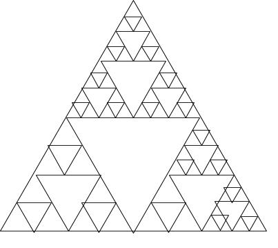

**Question:** 
Draw a call stack for the Tower of Hanoi problem. Assume that you start with a stack of three disks.

**Answer:**

> move_tower called, height is 3 
>
>> move_tower called, height is 2 
>>
>>> move_tower called, height is 1 
>>>
>>>> move_tower called, height is 0 
>>>
>>> at pole A - disk 1 
>>>
>>> moving disk 1 from pole A to pole B 
>>>
>>>> move_tower called, height is 0 
>>>
>>> at pole A - disk 2 
>>>
>>> moving disk 2 from pole A to pole C 
>>>
>>>> move_tower called, height is 1 
>>>>
>>>>> move_tower called, height is 0 
>>>>
>>>> at pole B - disk 1 
>>>>
>>>> moving disk 1 from pole B to pole C 
>>>>
>>>>> move_tower called, height is 0 
>>>>
>>>> at pole A - disk 3 
>>>>
>>>> moving disk 3 from pole A to pole B 
>>>>
>>>>> move_tower called, height is 2 
>>>>>
>>>>>> move_tower called, height is 1 
>>>>>>
>>>>>>> move_tower called, height is 0 
>>>>>>
>>>>>> at pole C - disk 1 
>>>>>>
>>>>>> moving disk 1 from pole C to pole A 
>>>>>>
>>>>>>> move_tower called, height is 0 
>>>>>>
>>>>>> at pole C - disk 2 
>>>>>>
>>>>>> moving disk 2 from pole C to pole B 
>>>>>>
>>>>>>> move_tower called, height is 1 
>>>>>>>
>>>>>>>> move_tower called, height is 0 
>>>>>>>
>>>>>>> at pole A - disk 1 
>>>>>>>
>>>>>>> moving disk 1 from pole A to pole B 
>>>>>>>
>>>>>>>> move_tower called, height is 0

***

**Question:** 
Using the recursive rules as described, draw a Sierpinski triangle using paper and pencil.

**Answer:**



***

**Question:** 
Using the dynamic programming algorithm for making change, find the smallest number of coins that you 
can use to make 33 cents in change. In addition to the usual coins assume that you have an 8 cent coin.

**Answer:**

````text
2 coins
They are:
8
25
The used list is as follows:
[1, 1, 1, 1, 1, 5, 1, 1, 8, 1, 10, 1, 1, 5, 1, 5, 8, 1, 8, 1, 10, 21, 1, 1, 8, 25, 1, 1, 8, 8, 5, 10, 1, 8]
````
